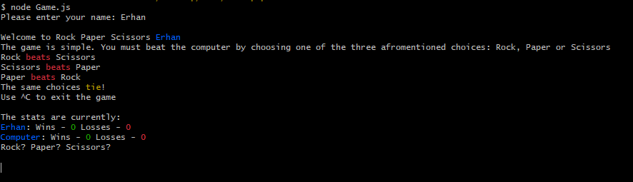
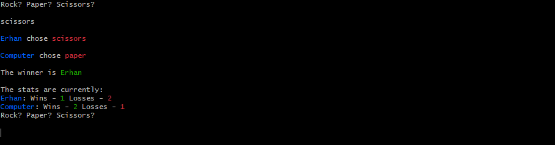
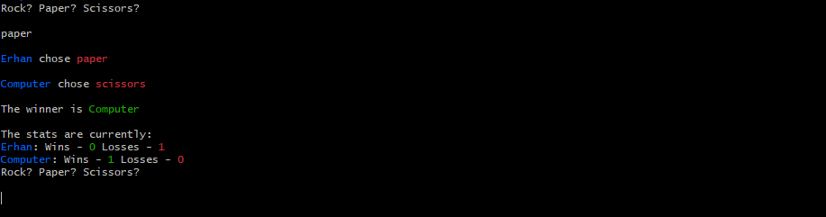
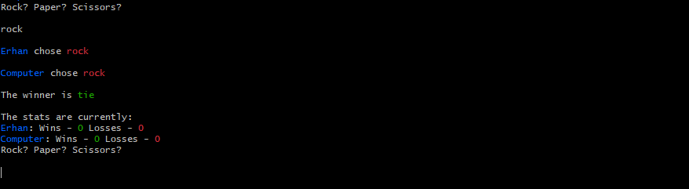
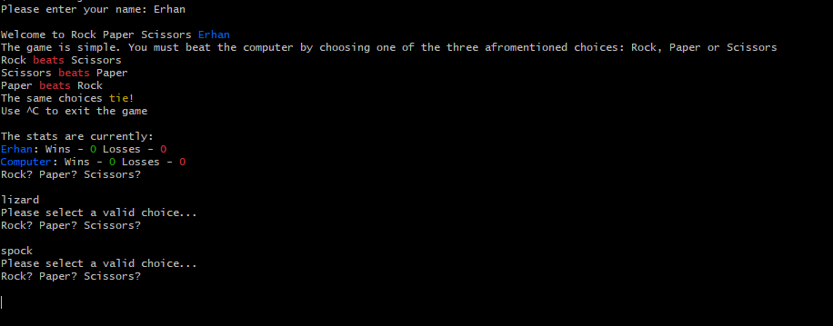

# Simple Rock-Paper-Scissors Game in the Terminal :scissors:

### Start of game

### Win

### Loss

### Tie

### Invalid input

### Possible improvments to be made: 
1. Add a function to add delay between prompts, inputs and winner reveal to add more immersion
2. Add a GUI 
3. Make a more complex version of the game by adding Lizard and Spock choices 
[Rock Paper Scissors Lizard Spock](https://www.instructables.com/How-to-Play-Rock-Paper-Scissors-Lizard-Spock/) 
